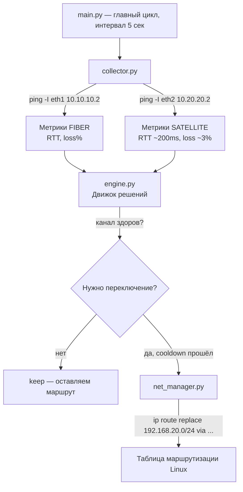

# SD-WAN Учебный Проект

> Модуль 3 · Введение в SD-WAN · Командное задание (3 недели)

---

## Техническое задание

```
Цель: смоделировать работу SD-WAN на основе VPN-туннелей и скриптов.

Команда 1 — «Традиционный WAN»
  Настроить между двумя филиалами статический IPsec-туннель.
  Показать его недостаток: разрыв при падении канала без автовосстановления.

Команда 2 — «SD-WAN»
  Настроить два канала между филиалами: «оптоволоконный» (быстрый)
  и «спутниковый» (высокая задержка + потери пакетов).
  Реализовать на Python механизм мониторинга (ICMP) и автоматического
  переключения трафика на лучший канал по метрикам RTT и packet loss.

Результат: совместная демонстрация преимущества динамического выбора пути.
```

---

## Стек технологий

| Слой              | Инструмент                               |
| ----------------- | ---------------------------------------- |
| Контейнеризация   | Docker, Docker Compose                   |
| Сетевой стек      | iproute2 (`ip route`), `tc netem`        |
| VPN (команда 1)   | strongSwan / IPsec IKEv2                 |
| Мониторинг (к. 2) | Python 3, `ping` (iputils)               |
| Деградация канала | `tc qdisc netem` (задержка + потери)     |
| ОС контейнеров    | Alpine 3 (команда 1), Ubuntu 24.04 (к.2) |

---

## Архитектура проекта

```
sd-wan-lab/
├── README.md                   ← этот файл
│
├── teams1/                     ← Команда 1: Традиционный WAN (IPsec)
│   ├── compose.yaml            ← два контейнера в одной bridge-сети
│   ├── dockerfile              ← Alpine + strongSwan
│   └── config/
│       ├── a-ipsec.conf        ← конфиг IPsec для branch-a
│       ├── a-ipsec.secrets.txt ← PSK для branch-a
│       ├── b-ipsec.conf        ← конфиг IPsec для branch-b
│       └── b-ipsec.secrets.txt ← PSK для branch-b
│
└── teams2/                     ← Команда 2: SD-WAN
    ├── docker-compose.yaml     ← два филиала, четыре изолированных сети
    ├── Dockerfile              ← Ubuntu 24.04 + iproute2 + python3
    ├── branch_entrypoint.sh   ← инициализация сети и запуск контроллера
    ├── main.py                 ← точка входа контроллера, главный цикл
    ├── collector.py            ← сбор ICMP-метрик (RTT, packet loss)
    ├── engine.py               ← движок решений с гистерезисом
    └── net_manager.py          ← применение маршрута через iproute2
```

---

## Архитектура Команды 2 (SD-WAN)

### Топология сетей

```
                    ┌─────────────────────┐
                    │     branch_a         │
                    │  (SD-WAN Controller) │
                    │  192.168.10.2        │
                    └──┬──────────┬────────┘
                       │          │
              fiber_net│          │sat_net
          10.10.10.0/30│          │10.20.20.0/30
           (быстрый,   │          │(задержка 200ms,
            < 5ms RTT) │          │ jitter 30ms,
                       │          │ потери 3%)
                       │          │
                    ┌──┴──────────┴────────┐
                    │     branch_b         │
                    │  192.168.20.2        │
                    └─────────────────────┘

branch_a_lan: 192.168.10.0/24  (LAN филиала A)
branch_b_lan: 192.168.20.0/24  (LAN филиала B — цель маршрутизации)
```

### Как работает контроллер



### Логика выбора канала

```
Fiber  RTT < 400ms  И  loss < 10%  →  HEALTHY  →  приоритет (metric 10)
Fiber  RTT > 400ms  ИЛИ loss > 10% →  UNHEALTHY → переключаемся на Satellite

После восстановления Fiber:
  cooldown 15 сек  →  возврат на Fiber (primary restored)
```

### Модули контроллера

| Файл             | Роль            | Ключевая логика                                      |
| ---------------- | --------------- | ---------------------------------------------------- |
| `main.py`        | Оркестратор     | Главный цикл, склейка всех модулей, логирование      |
| `collector.py`   | «Глаза» системы | `ping -I ethX -c 4 -i 0.2`, парсинг RTT и loss       |
| `engine.py`      | «Мозг» системы  | Пороги + гистерезис cooldown против флаппинга        |
| `net_manager.py` | «Руки» системы  | `ip route replace <cidr> via <gw> dev <if> metric N` |

---

## Архитектура Команды 1 (IPsec)

```
branch-a (10.0.0.10) ←——— IPsec IKEv2 tunnel ———→ branch-b (10.0.0.20)
         └────────────── wan_net 10.0.0.0/24 ───────────────┘

Единственный канал. При падении — туннель не восстанавливается автоматически.
```

---

## Быстрый старт

### Требования

- Docker ≥ 24.0 и Docker Compose ≥ 2.20
- Linux / macOS / WSL2
- Права на запуск privileged-контейнеров

---

## Инструкция — Команда 1: Традиционный WAN (IPsec)

### 1. Клонируем репозиторий

```bash
git clone <URL репозитория>
cd sd-wan-lab
```

### 2. Собираем и запускаем контейнеры

```bash
docker compose -f teams1/compose.yaml up -d --build
```

Дождитесь запуска — оба контейнера `branch-a` и `branch-b` поднимутся,
strongSwan автоматически начнёт согласование IKEv2.

### 3. Проверяем, что туннель поднялся

```bash
docker exec -it branch-a ipsec status
```

Ожидаемый вывод (успех):
```
branchA-to-branchB[1]: ESTABLISHED 10 seconds ago, 10.0.0.10[10.0.0.10]...10.0.0.20[10.0.0.20]
branchA-to-branchB{1}: INSTALLED, TUNNEL, ...
```

Строка `ESTABLISHED` — ключи согласованы, туннель активен.
Строка `INSTALLED, TUNNEL` — трафик шифруется и идёт через IPsec.

### 4. Проверяем связность через туннель

```bash
docker exec -it branch-a ping -c 5 10.0.0.20
```

Ожидаемый результат — `0% packet loss`, пакеты ходят через зашифрованный туннель.

### 5. Демонстрация недостатка — симулируем обрыв канала

Блокируем трафик от branch-a на уровне branch-b (имитация падения провайдера):

```bash
docker exec -it branch-b iptables -I INPUT -s 10.0.0.10 -j DROP
```

Теперь смотрим на ping — он зависает и начинает терять пакеты:

```bash
docker exec -it branch-a ping 10.0.0.20
# 100% packet loss — туннель лёг, восстановления нет
```

**Вывод:** традиционный IPsec WAN не имеет механизма автоматического
переключения на резервный канал. Связь восстановится только после
ручного вмешательства администратора.

### 6. Восстанавливаем связность

```bash
docker exec -it branch-b iptables -D INPUT -s 10.0.0.10 -j DROP
```

После этого туннель поднимется заново (strongSwan пересогласует ключи).

### 7. Останавливаем стенд

```bash
docker compose -f teams1/compose.yaml down
```

---

## Инструкция — Команда 2: SD-WAN (динамический выбор пути)

### 1. Клонируем репозиторий (если ещё не сделано)

```bash
git clone <https://github.com/sma1kyyy/sdwan-vs-traditional>
cd sd-wan-lab
```

### 2. Собираем и запускаем стенд

```bash
docker compose -f teams2/docker-compose.yaml up --build
```

Флаг `--build` пересобирает образ при каждом запуске — это важно при изменении кода.
Логи контроллера сразу пойдут в консоль.

### 3. Наблюдаем за работой контроллера

Откройте **второй терминал** и следите за логами:

```bash
docker logs -f sdwan_branch_a
```

Нормальная работа выглядит так:
```
[INFO] [METRIC] fiber      up=True  rtt=    1.2ms loss=0.0%
[INFO] [METRIC] satellite  up=True  rtt=  213.4ms loss=3.0%
[INFO] [DECISION] keep FIBER      (active healthy)
```

Контроллер каждые 5 секунд:
- пингует оба канала
- выводит RTT и процент потерь
- принимает решение о маршруте

### 4. Проверяем начальный маршрут

```bash
docker exec -it sdwan_branch_a ip route show
```

Маршрут до `192.168.20.0/24` должен идти через `eth1` (fiber, metric 10).

### 5. Сценарий аварии — роняем оптику

В **третьем терминале** отключаем интерфейс fiber у branch_a:

```bash
docker exec -it sdwan_branch_a ip link set eth1 down
```

В логах контроллера увидим переключение:
```
[METRIC] fiber      up=False rtt= 9999.0ms loss=100.0%
[METRIC] satellite  up=True  rtt=  215.2ms loss=2.5%
[DECISION] *** switch => SATELLITE (switched due to degradation) ***
```

Проверяем, что маршрут сменился:
```bash
docker exec -it sdwan_branch_a ip route show
# 192.168.20.0/24 via 10.20.20.2 dev eth2 metric 100
```

Связь с филиалом B сохраняется через спутниковый канал — пинг продолжает идти:

```bash
docker exec -it sdwan_branch_a ping 192.168.20.2
```

### 6. Восстановление — возвращаем оптику

```bash
docker exec -it sdwan_branch_a ip link set eth1 up
```

Через 15 секунд (cooldown) контроллер вернёт трафик на fiber:
```
[METRIC] fiber      up=True  rtt=    1.1ms loss=0.0%
[DECISION] *** switch => FIBER (primary restored) ***
```

Cooldown защищает от «флаппинга» — быстрого туда-обратного переключения
при нестабильном канале.

### 7. Сравнение каналов (опционально)

Запустите ping до branch_b через оба канала одновременно, чтобы наглядно
увидеть разницу задержек:

```bash
# Оптика — быстрый канал
docker exec -it sdwan_branch_a ping -I eth1 -c 10 10.10.10.2

# Спутник — деградированный канал (netem: 200ms задержка, 3% потери)
docker exec -it sdwan_branch_a ping -I eth2 -c 10 10.20.20.2
```

### 8. Останавливаем стенд

```bash
docker compose -f teams2/docker-compose.yaml down
```

---

## Совместная демонстрация (финальный сценарий)

| Шаг | Команда 1 (IPsec)                               | Команда 2 (SD-WAN)                            |
| --- | ----------------------------------------------- | --------------------------------------------- |
| 1   | Показываем работающий туннель, `ipsec status`   | Показываем логи контроллера, трафик на fiber  |
| 2   | Роняем канал через `iptables -I INPUT ... DROP` | Роняем `ip link set eth1 down`                |
| 3   | Ping висит — связи нет, ручное вмешательство    | Контроллер переключается на спутник за ~5 сек |
| 4   | Восстанавливаем iptables вручную                | Восстанавливаем eth1, контроллер сам вернётся |
| 5   | **Вывод:** статика, нет автоматики              | **Вывод:** динамика, нулевое вмешательство    |

---

## Ключевые различия: WAN vs SD-WAN

| Критерий                   | Традиционный WAN (команда 1) | SD-WAN (команда 2)                   |
| -------------------------- | ---------------------------- | ------------------------------------ |
| Резервный канал            | Нет                          | Есть (спутник)                       |
| Реакция на обрыв           | Никакой — вечно ждёт         | Автоматически за ≤10 сек             |
| Мониторинг качества канала | Только физический линк       | RTT + packet loss в реальном времени |
| Возврат на основной канал  | Вручную                      | Автоматически (cooldown 15 с)        |
| Защита от флаппинга        | Нет                          | Гистерезис (cooldown)                |
| Управление маршрутами      | Статический конфиг           | Программный контроллер               |