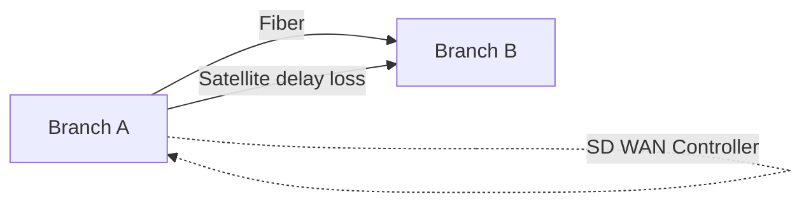

# SD WAN учебный проект, общий README

## ТЗ:

``` text
Модуль 3: Введение в SD-WAN
Тема: Проблемы традиционных WAN. Принципы SD-WAN (централизованное управление, overlay-сети, динамический выбор пути).
Задание 3: "Строим виртуальную магистраль" (Командное, 3 недели)
Цель: Смоделировать работу SD-WAN на основе VPN-туннелей и скриптов.
Задача для команд:
    • Используя облачные платформы (AWS/Azure бесплатные tier) или виртуальные машины (VirtualBox/VMware), развернуть два "филиала".
    • Команда 1 ("Традиционный WAN"): Настроить между филиалами статический IPsec-туннель. Показать его недостатки: разрыв при падении одного из каналов.
    • Команда 2 ("SD-WAN"): Настроить два канала связи между филиалами (например, имитацию "спутникового" канала с высокой задержкой и "оптоволоконного"). Реализовать на базе скриптов (Python/Bash) простейший механизм мониторинга (ping) и автоматического переключения трафика на лучший канал на основе метрик (задержка, потери пакетов).
Результат: Совместная демонстрация от команд 1 и 2, наглядно показывающая преимущество динамического выбора пути. Диаграмма развернутой архитектуры.
```

## Team2

для второй команды есть полноценный Docker сценарий с двумя виртуальными филиалами в контейнерах
То есть branch_a и branch_b поднимаются через docker compose, и в branch_a сразу стартует SD WAN контроллер

## Архитектура

branch_a и branch_b соединены двумя сетями
fiber_net быстрый канал
sat_net канал с netem деградацией

Контроллер в branch_a мониторит оба канала и переключает маршрут до LAN branch_b

## Диаграмма



## Быстрый запуск Team2 через Docker

```bash
docker compose -f team2/docker-compose.yml up --build
```

## Проверка failover на демо

Открыть второй терминал и уронить fiber интерфейс у branch_a

```bash
docker exec -it sdwan_branch_a ip link set eth1 down
```

Вернуть обратно

```bash
docker exec -it sdwan_branch_a ip link set eth1 up
```

Смотреть логи контроллера

```bash
docker logs -f sdwan_branch_a
```

## Остановка

```bash
docker compose -f team2/docker-compose.yml down
```