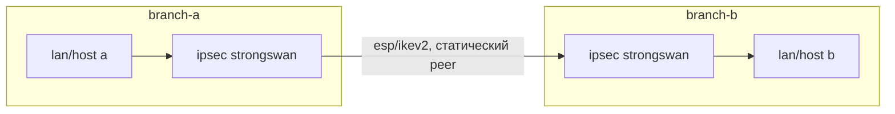
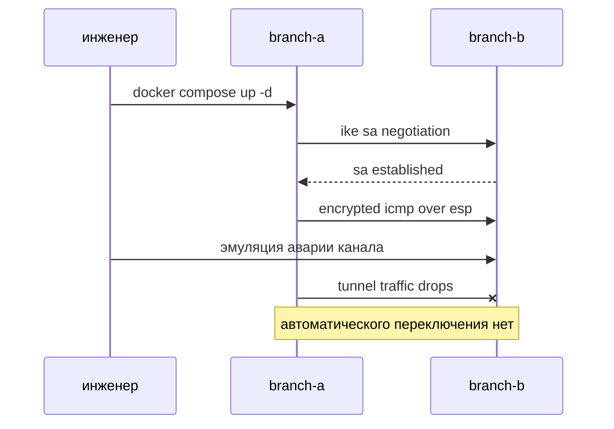

# WORK Team 1 | Traditional WAN Simulation Lab

## архитектурный ландшафт проекта

в этом стенде реализована классическая модель традиционного wan между двумя филиалами
филиалы соединены статическим ipsec site-to-site туннелем без резервных путей и без автоматического failover

---

## диаграмма архитектуры





---

## состав решения

### инфраструктура
- `compose.yaml` поднимает два контейнера branch-a и branch-b в общей docker-сети для имитации площадок
- `dockerfile` собирает образ с strongswan и вспомогательными сетевыми утилитами

### конфигурация ipsec
- `config/a-ipsec.conf` и `config/b-ipsec.conf` задают статические параметры ike/esp и peer endpoints
- `config/a-ipsec.secrets.txt` и `config/b-ipsec.secrets.txt` содержат pre-shared key для аутентификации

### документация
- `manual.md` описывает демонстрационный сценарий запуска, проверки и деградации
- `vivod.md` фиксирует аналитический вывод о границах традиционного подхода

---

## запуск и проверка

### 1) старт стенда
```bash
docker compose -f teams1/compose.yaml up -d --build
```

### 2) проверка статуса туннеля
```bash
docker exec -it branch-a ipsec status
```
ожидаемый признак успеха: состояние established и installed

### 3) проверка передачи через tunnel
```bash
docker exec -it branch-a ping -c 4 10.0.0.20
```
ожидаемый признак успеха: packet loss 0%

### 4) демонстрация недостатка традиционного wan
эмулируем отказ доступности со стороны branch-b
```bash
docker exec -it branch-b iptables -I INPUT -s 10.0.0.10 -j DROP
```
после этого трафик branch-a к branch-b перестает проходить, так как резервного канала и механизма выбора пути нет

### 5) восстановление
```bash
docker exec -it branch-b iptables -D INPUT -s 10.0.0.10 -j DROP
```

---

## что демонстрирует team 1

традиционный wan в лабораторном виде корректно показывает базовую криптозащиту канала между филиалами
при этом в архитектуре отсутствуют динамическая телеметрия, оценка sla-метрик и автоматический reroute
это делает решение уязвимым к деградации и отказам транспортного уровня
