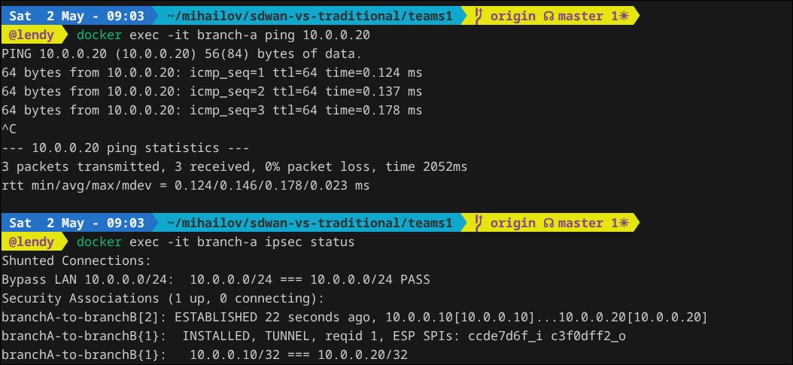
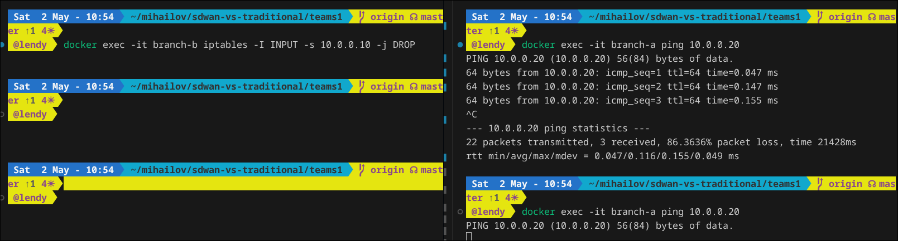

# manual team 1

## цель демонстрации
показать, как работает статический ipsec-туннель между двумя филиалами и почему традиционный wan теряет устойчивость при сбое канала

## предпосылки
- установлен docker и запущен docker daemon
- запуск выполняется из корня репозитория

## шаг 1: запуск инфраструктуры
```bash
docker compose -f teams1/compose.yaml up -d --build
```


## шаг 2: убедиться, что ipsec поднялся
```bash
docker exec -it branch-a ping 10.0.0.20
### Cтатус IPsec
docker exec -it branch-a ipsec status
```
в корректном состоянии вы увидите признаки established и installed для sa



В выводе ipsec status строка ESTABLISHED 46 seconds ago и INSTALLED, TUNNEL. Это означает, что криптографические ключи успешно согласованы, и IPsec-туннель между филиалом А и филиалом Б поднят. Трафик теперь шифруется (ESP SPIs).

В выводе ping 0% packet loss. Пакеты успешно бегают внутри этого зашифрованного туннеля.

### Демонстрация недостатка (разрыв канала).

Традиционный WAN привязан к конкретным IP/интерфейсам. Чтобы симулировать падение "провайдера", можно просто срубить интерфейс в branch-b или заблокировать трафик через iptables:

## шаг 3: проверить связность через туннель
```bash
docker exec -it branch-a ping -c 4 10.0.0.20
```
если потери 0%, значит передача по шифрованному туннелю работает штатно



Пинг из пункта 2 повиснет и сдохнет. В SD-WAN система бы заметила потерю пакетов и автоматически перекинула трафик на резервный канал (например, 4G/LTE), а тут у нас тупой статический IPsec, который будет просто лежать и ждать, пока админ (ты) не починит сеть ручками.

## шаг 4: эмулировать отказ и показать ограничение традиционного wan
```bash
docker exec -it branch-b iptables -I INPUT -s 10.0.0.10 -j DROP
```
после применения правила туннельный трафик перестает проходить, автоматического переключения на альтернативный транспорт не происходит

## шаг 5: восстановление после отказа
```bash
docker exec -it branch-b iptables -D INPUT -s 10.0.0.10 -j DROP
```

## шаг 6: остановка стенда
```bash
docker compose -f teams1/compose.yaml down
```